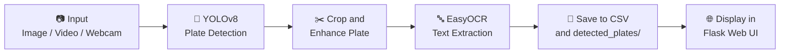

<div align="center">

<!-- HERO BANNER -->


<br/>

[](https://python.org)
[](https://flask.palletsprojects.com/)
[](https://github.com/ultralytics/ultralytics)
[](https://opencv.org/)
[](https://github.com/JaidedAI/EasyOCR)
[](LICENSE)

<br/>

> **An intelligent, real-time license plate detection and OCR system** built with YOLOv8 + EasyOCR, wrapped in a sleek Flask web interface — detect plates from images, videos, or live webcam streams with one click.

<br/>

</div>

---

## ✨ Key Features

| Feature | Description |
|--------|------------|
| 🎯 **YOLOv8 Detection** | Custom-trained model (`best.pt`) fine-tuned on Nepali license plates for high accuracy |
| 🔤 **EasyOCR Text Reading** | Reads and extracts plate characters after detection |
| 🖼️ **Image Upload** | Upload JPG/PNG images and get annotated results instantly |
| 🎬 **Video Processing** | Stream processed video frame-by-frame via MJPEG |
| 📸 **Live Webcam** | Real-time license plate recognition from your webcam |
| 🗄️ **Detection History** | All detections saved to CSV with timestamps and confidence scores |
| 📊 **Live Stats Dashboard** | Real-time counters for total detections, plates read, and last source |
| 💾 **CSV Export** | Download the full detection log with one click |
| 🗑️ **Clear History** | Wipe the detection log and saved plate images |
| 🧠 **Plate Enhancement** | LANCZOS upscaling + sharpening + CLAHE contrast for better OCR |

---

## 🖥️ Demo

<div align="center">

```
┌──────────────────────────────────────────────────────────────┐
│  🔍 Detections: 124   🔤 Plates Read: 98   📹 Last: Webcam  │
├────────────────────┬─────────────────────────────────────────┤
│                    │  📁 Upload Image / Video                │
│   LIVE WEBCAM      │  ─────────────────────────────────────  │
│   FEED             │  🎥 Live Webcam                         │
│   [YOLOv8 boxes]   │  ─────────────────────────────────────  │
│                    │  📋 Detection History Table             │
└────────────────────┴─────────────────────────────────────────┘
```

</div>

---

## 📁 Project Structure

```
license plate project/
│
├── 📄 app.py                       # Flask web server & all API routes
├── 📄 detection.py                 # YOLOv8 inference + EasyOCR pipeline
├── 📄 webcam_test.py               # Standalone webcam test script
├── 📄 detections.csv               # Detection log (auto-generated)
├── 📄 requirements.txt             # Python dependencies
│
├── 📂 model/
│   └── 🤖 best.pt                  # Trained YOLOv8 weights (~5.1 MB)
│
├── 📂 templates/
│   └── 🌐 index.html               # Jinja2 frontend template
│
├── 📂 static/
│   ├── 🎨 style.css                # All UI styling (dark glassmorphism)
│   └── ⚡ app.js                   # Frontend JS (stats polling, UI logic)
│
├── 📂 Nepali_License_Plates_Images/
│   └── 🖼️ *.jpg                    # Sample Nepali plate images for testing
│
├── 📂 detected_plates/             # Auto-saved cropped plate images
├── 📂 uploads/                     # Uploaded & processed media files
└── 📂 .venv/                       # Python virtual environment
```

---

## ⚙️ How It Works



### Detection Pipeline — Step by Step

1. **Input** — User uploads an image/video or starts the webcam
2. **YOLO Inference** — `best.pt` detects bounding boxes of license plates at 960px resolution (640px for webcam)
3. **Plate Crop** — The detected region is cropped with 6px padding
4. **Enhancement** — LANCZOS upscaling → sharpening kernel → CLAHE contrast boost
5. **OCR** — EasyOCR reads alphanumeric text from the enhanced crop
6. **Logging** — Timestamp, source, confidence, text, and plate image saved to `detections.csv`
7. **Streaming** — Annotated frames are encoded as MJPEG and streamed to the browser

---

## 🚀 Getting Started

### Prerequisites

* Python **3.9+**
* A webcam (optional, for live detection)
* ~2 GB free disk space (PyTorch + dependencies)

### 1. Clone the Repository

```bash
git clone https://github.com/AaratiGiri/License-Plate-Detector.git
cd License-Plate-Detector
```

### 2. Create a Virtual Environment

```bash
python -m venv .venv
```

**Windows PowerShell:**

```powershell
.\.venv\Scripts\Activate.ps1
```

**macOS / Linux:**

```bash
source .venv/bin/activate
```

### 3. Install Dependencies

```bash
pip install -r requirements.txt
```

> **requirements.txt** includes:
> `Flask` · `ultralytics` · `opencv-python` · `easyocr` · `PyYAML` · `torch`


### 4. Add the Model

Place your trained YOLOv8 weights inside the `model/` folder:

```
model/
└── best.pt   ← put your weights file here
```

### 5. Run the App

```bash
python app.py
```

Open your browser and go to **[http://127.0.0.1:5000](http://127.0.0.1:5000)**

---

## 🌐 API Reference

| Method | Endpoint | Description |
|--------|----------|-------------|
| `GET` | `/` | Main web interface |
| `POST` | `/upload` | Upload an image or video for processing |
| `GET` | `/video_feed/<filename>` | MJPEG stream of a processed video |
| `GET` | `/webcam_feed` | MJPEG stream from the live webcam |
| `GET` | `/detected/<filename>` | Serve a saved plate crop image |
| `GET` | `/uploads/<filename>` | Serve an uploaded/result image |
| `GET` | `/api/records?limit=30` | JSON array of recent detections |
| `GET` | `/api/stats` | JSON stats: total, plates read, last source |
| `GET` | `/download_csv` | Download `detections.csv` |
| `POST` | `/clear_history` | Clear CSV log and all detected plate images |

---

## 📋 Detection CSV Format

Each detection is saved with the following fields:

```csv
timestamp,source,confidence,plate_text,plate_image
2026-09-22 21:22:38,video:traffic.mp4,0.9231,BA 1 KHA 4321,plate_20260922_212238_363766_0.jpg
2026-09-22 21:22:50,webcam,0.8874,KO 3 PA 2019,plate_20260922_212250_182802_0.jpg
```

| Field | Description |
|-------|-------------|
| `timestamp` | Date & time of detection |
| `source` | `image:filename`, `video:filename`, or `webcam` |
| `confidence` | YOLO detection confidence (0–1) |
| `plate_text` | OCR-extracted text (may be empty if unreadable) |
| `plate_image` | Filename of the saved plate crop in `detected_plates/` |

---

## 🔧 Configuration

You can tweak these values directly in `app.py` and `detection.py`:

| Parameter | Default | Description |
|-----------|---------|-------------|
| `confidence_threshold` | `0.25` | Minimum YOLO confidence to accept a detection |
| `image_size` (images/video) | `960` | YOLO inference resolution |
| `image_size` (webcam) | `640` | YOLO inference resolution for live feed |
| `save_every` | `fps` frames | Save one detection record per second from video |
| Webcam `save_every` | `30` frames | Save webcam detection every 30 frames |
| `PAD` | `6` px | Padding around the plate bounding box for cropping |
| `MAX_CONTENT_LENGTH` | `500 MB` | Maximum upload file size |

---

## 🛠️ Tech Stack

<div align="center">

| Layer | Technology |
|-------|-----------|
| **Web Framework** | Flask (Python) |
| **Object Detection** | YOLOv8 via Ultralytics |
| **OCR** | EasyOCR |
| **Computer Vision** | OpenCV |
| **Frontend** | HTML5, Vanilla CSS, JavaScript |
| **Streaming** | MJPEG over HTTP (multipart) |
| **Data Storage** | CSV flat-file |
| **Model Format** | PyTorch `.pt` |

</div>

---

## 📦 Supported File Formats

| Type | Formats |
|------|---------|
| **Images** | `.jpg`, `.jpeg`, `.png` |
| **Videos** | `.mp4`, `.avi`, `.mov`, `.mkv`, `.mpeg`, `.mpg`, `.webm` |

---

## 🤝 Contributing

Contributions are welcome! Here's how to get started:

1. **Fork** this repository
2. **Create** a feature branch: `git checkout -b feature/amazing-feature`
3. **Commit** your changes: `git commit -m 'Add amazing feature'`
4. **Push** to the branch: `git push origin feature/amazing-feature`
5. **Open** a Pull Request

---

## 🙏 Acknowledgements

- [**Ultralytics YOLOv8**](https://github.com/ultralytics/ultralytics) — State-of-the-art object detection
- [**EasyOCR**](https://github.com/JaidedAI/EasyOCR) — Ready-to-use OCR for 80+ languages
- [**OpenCV**](https://opencv.org/) — The backbone of computer vision
- [**Flask**](https://flask.palletsprojects.com/) — Lightweight and powerful Python web framework
- Training data: Nepali vehicle license plate images dataset

---

<div align="center">


**Made with ❤️ for AI-powered traffic monitoring**

⭐ *If you found this useful, give it a star!* ⭐

</div>
